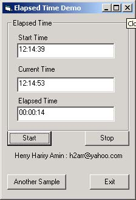



## Elapsed Time

### Description

Count an elapsed time between two times
 
### More Info
 

             |
---                |---
**Submitted On**   |2001-04-05 08:28:08
**By**             |[Herry Hariry Amin](https://github.com/Planet-Source-Code/PSCIndex/blob/master/ByAuthor/herry-hariry-amin.md)
**Level**          |Beginner
**User Rating**    |4.3 (13 globes from 3 users)
**Compatibility**  |VB 5\.0, VB 6\.0
**Category**       |[Complete Applications](https://github.com/Planet-Source-Code/PSCIndex/blob/master/ByCategory/complete-applications__1-27.md)
**World**          |[Visual Basic](https://github.com/Planet-Source-Code/PSCIndex/blob/master/ByWorld/visual-basic.md)
**Archive File**   |[Elapsed\_Ti14952411112002\.zip](https://github.com/Planet-Source-Code/herry-hariry-amin-elapsed-time__1-40602/archive/master.zip)

